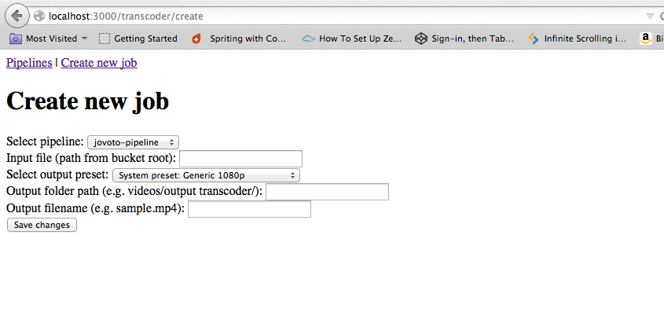
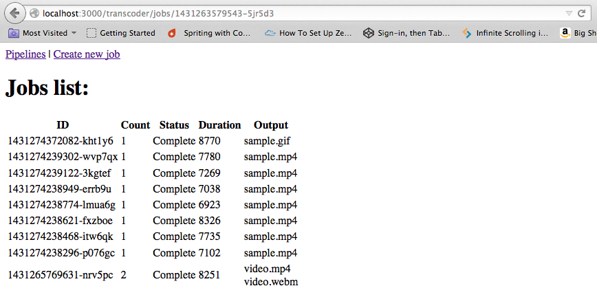

# Small Rails app that uses AWS Elastic Transcoder
## It transcodes the video into other formats and also saves a thumbnail for it

**Atention, necessary steps:**
Set in your environment the current variables:
- $S3_BUCKET_NAME (S3 bucket name where the videos are uploaded through paperclip)
- $AWS_ACCESS_KEY_ID (Amazon user access key ID)
- $AWS_SECRET_ACCESS_KEY (Amazon user secret access key)
- $AWS_REGION (e.g. 'eu-west-1')

## Assumptions for this sample:
* There is already a pipeline created, with the relevant information:
	* pipeline name
	* input bucket
	* output bucket
	* IAM Role (with S3 Permissions)

## Approach:
Since the procedure of getting the the files into the S3 bucket is not the main focus for this task, I have decided to focus entirely on dispatching the video transcoding jobs and to investigate if the final file location could be predicted to report back to paperclip.

As I it was my first time using AWS Elastic Transcoder, but not my first time using AWS and therefore aws-sdk, the first step was to read the [available documentation at AWS](http://docs.aws.amazon.com/sdkforruby/api/Aws/ElasticTranscoder.html).

After reading it and analysing it I have reached the conclusion that there are 3 main elements on the process of transcoding videos on AWS:
* Pipelines
	* It is a pipeline that processes the jobs sent his way
* Jobs
	* A description of the video processing required, based on presets.
* Presets
	* Presets of transcoding details such as file type, thumbnail sizes, framerate, etc.

Based on this the main focus for the configuration of the video transcoding it self can be done through aws console by creating some presets once and then reuse them on jobs.

*Disclaimer: It can also be created through the ruby SDK, but I didn't focus on that as I didn't want to complicate a smooth transition that this could enable*

The pipelines required to dispatch jobs to AWS Elastic Transcoder can also be created through the console or SDK. Since this one can be required to create new ones and delete old ones in runtime, check the [lib file created](lib/aws-transcoder/elastic_transcoder.rb) to see how to create a new pipeline on runtime.

Being the interesting part the creation of new transcode jobs on-demand I have created a sample rails app that allows the user to see the current existing pipelines, see their current and completed jobs and also create a new job and dispatch it to the pipeline.

## Usage:
*Do not forget to: setup the environment variables for the AWS configurations and create a pipeline on AWS*

1. Run the rails server and access the url: http://localhost:3000/transcoder/
2. If created the pipeline was created on the correct region it will show on the pipeline list, like the following picture:
 
3. By clicking on the "Create new job" it leads to a simple form that enables the creation of a new job by selecting the pipeline, preset, input file and output file location and name.
 
4. After creating a job it will be redirected to the target pipeline jobs list, being able to see the status, duration and output files of the jobs dispatched to that same pipeline.

#Result:

With this I gained knowledge to be comfortable working with AWS Elastic Transcoder through their SDK, enabling to dispatch the transcoding jobs to the proper pipeline when required by the Jovoto platform through the insertion of a new video from a user. Enabling it to transcode, create thumbnails and more all within the AWS environment, not needing the current upload/download dependence from the servers to execute this jobs. All this by being able to set defaults and patterns that allows the video transcoding results to be where they are expected to in the end.
